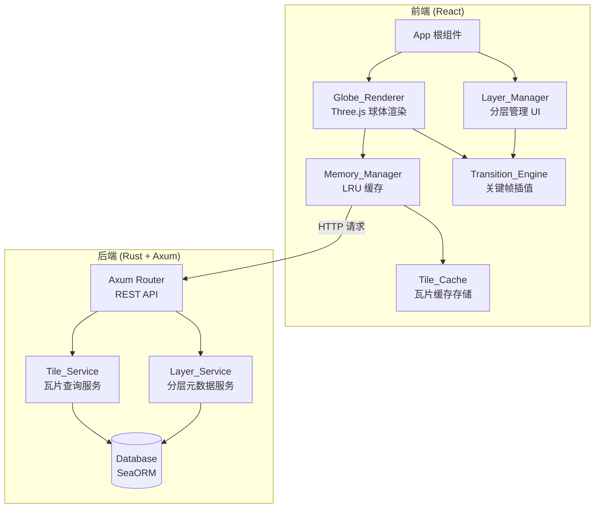
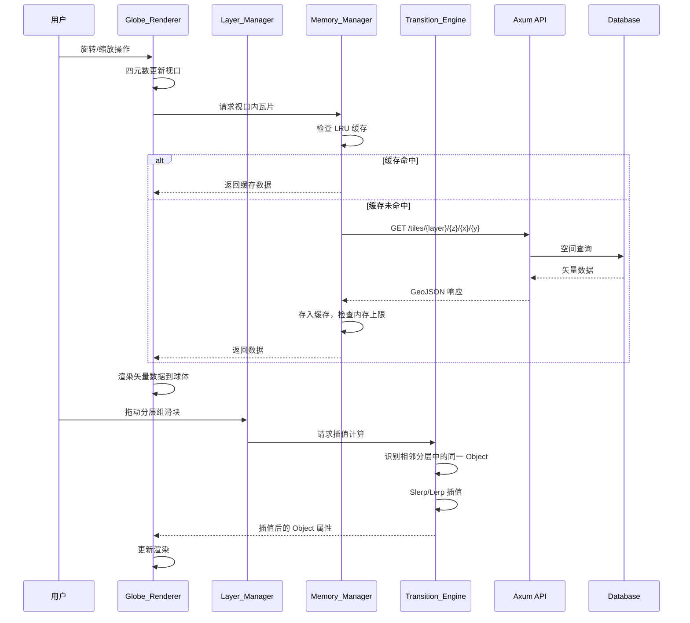

# Design Document: Vector Globe Viewer

## Overview

本设计文档描述一个交互式透明球体矢量数据可视化应用的技术架构。系统采用前后端分离架构：前端基于 React + Three.js（通过 react-three-fiber）渲染透明 3D 球体并处理用户交互；后端基于 Rust + Axum + SeaORM 提供矢量瓦片数据服务。

### 核心技术选型

- **3D 渲染**: [react-three-fiber](https://github.com/pmndrs/react-three-fiber) — React 的 Three.js 声明式绑定，支持自定义 shader 实现透明球体
- **旋转模型**: 四元数（Quaternion）旋转，避免万向节锁，使用 Three.js 内置 `THREE.Quaternion`
- **矢量简化**: Ramer-Douglas-Peucker 算法，后端预计算多 LOD 级别
- **空间索引**: 基于瓦片坐标系（z/x/y）的空间查询，后端使用数据库索引加速
- **数据格式**: GeoJSON 传输，支持 gzip 压缩
- **缓存策略**: 前端 LRU 缓存 + 基于 viewport 的淘汰策略
- **插值引擎**: 球面线性插值（Slerp）用于经纬度过渡，线性插值（Lerp）用于其他属性

### 关键设计决策

1. **使用 react-three-fiber 而非原生 Three.js**: 与 React 生态无缝集成，声明式 API 更易维护，同时保留底层 Three.js 的全部能力。
2. **自定义 shader 实现透明球体**: 使用 `ShaderMaterial` 而非 `MeshPhysicalMaterial`，可精确控制透明度、边缘光效果和经纬网格渲染。
3. **后端预计算 LOD**: 在数据导入时使用 Douglas-Peucker 算法预生成多精细度版本，避免运行时计算开销。
4. **瓦片坐标系而非任意空间查询**: 采用标准 z/x/y 瓦片编址，利于缓存命中和 CDN 分发。
5. **Slerp 用于地理坐标插值**: 经纬度在球面上的最短路径需要球面插值，线性插值会导致路径偏离大圆弧。

## Architecture

### 系统架构图



### 数据流



### 前端模块划分

| 模块 | 职责 | 关键依赖 |
|------|------|----------|
| `Globe_Renderer` | 3D 球体渲染、用户交互（旋转/缩放）、矢量数据绑定到球面 | react-three-fiber, three.js |
| `Layer_Manager` | 分层列表 UI、启用/禁用分层、分层组滑块控件 | React state |
| `Memory_Manager` | LRU 缓存管理、内存上限控制、瓦片淘汰 | 自实现 LRU |
| `Transition_Engine` | Object 关键帧管理、Slerp/Lerp 插值、淡入淡出动画 | three.js math |
| `Tile_Cache` | 瓦片数据的实际存储结构 | Map |

### 后端模块划分

| 模块 | 职责 | 关键依赖 |
|------|------|----------|
| `Tile_Service` | 瓦片查询、LOD 选择、GeoJSON 序列化 | SeaORM, geo crate |
| `Layer_Service` | 分层/分层组元数据管理、Object 引用查询 | SeaORM |
| `API Router` | HTTP 路由、请求验证、响应压缩 | Axum, tower |

## Components and Interfaces

### 前端组件

#### Globe_Renderer

```typescript
interface GlobeRendererProps {
  layers: EnabledLayer[];           // 当前启用的分层列表
  interpolatedObjects: InterpolatedObject[]; // 插值后的物体数据
  onViewportChange: (viewport: Viewport) => void;
}

interface Viewport {
  quaternion: Quaternion;  // 当前旋转姿态（四元数）
  zoom: number;            // 当前缩放级别 [minZoom, maxZoom]
  visibleTiles: TileCoord[]; // 当前视口内可见的瓦片坐标列表
}

interface Quaternion {
  x: number;
  y: number;
  z: number;
  w: number;
}

interface TileCoord {
  z: number;  // 缩放级别
  x: number;  // 瓦片列号
  y: number;  // 瓦片行号
}
```

Globe_Renderer 使用自定义 `ShaderMaterial` 渲染透明球体：
- 顶点着色器：标准球体顶点变换
- 片元着色器：基于视角的 Fresnel 透明度 + 经纬网格线 + 矢量数据叠加

旋转交互流程：
1. 捕获 `pointerdown` 事件，记录起始点和当前四元数
2. `pointermove` 时计算增量旋转四元数（基于球面投影的 arcball 算法）
3. 将增量四元数与当前四元数相乘得到新姿态
4. `pointerup` 时根据最后几帧的角速度施加惯性衰减动画

#### Layer_Manager

```typescript
interface LayerManagerProps {
  layers: LayerMeta[];
  layerGroups: LayerGroupMeta[];
  onLayerToggle: (layerId: string, enabled: boolean) => void;
  onGroupSliderChange: (groupId: string, position: number) => void;
}

interface LayerMeta {
  id: string;
  name: string;
  description: string;
  enabled: boolean;
  lodLevels: number[];
}

interface LayerGroupMeta {
  id: string;
  name: string;
  layers: LayerMeta[];  // 组内分层，按顺序排列
  currentPosition: number; // 滑块当前位置 [0, layers.length - 1]
}
```

#### Memory_Manager

```typescript
interface MemoryManagerConfig {
  maxMemoryMB: number;       // 内存上限（桌面端默认 256MB，移动端 128MB）
  evictionTimeoutMs: number; // 离开视口后的淘汰延迟（默认 30000ms）
}

interface MemoryManager {
  get(key: TileCacheKey): TileData | null;
  put(key: TileCacheKey, data: TileData): void;
  evictOutOfViewport(currentViewport: Viewport): void;
  getMemoryUsage(): number;
}

type TileCacheKey = `${string}:${number}:${number}:${number}`; // layerId:z:x:y
```

LRU 实现使用 `Map` 的插入顺序特性：访问时删除再重新插入，淘汰时取第一个条目。

#### Transition_Engine

```typescript
interface TransitionEngine {
  buildKeyframes(group: LayerGroupMeta, objectRefs: ObjectRefMap): KeyframeSequence[];
  interpolate(sequences: KeyframeSequence[], position: number): InterpolatedObject[];
}

interface ObjectReference {
  objectId: string;
  layerId: string;
  properties: Record<string, number | string>;
  latitude: number;
  longitude: number;
}

interface Keyframe {
  layerIndex: number;       // 在分层组中的索引位置
  latitude: number;
  longitude: number;
  properties: Record<string, number | string>;
}

interface KeyframeSequence {
  objectId: string;
  keyframes: Keyframe[];    // 按 layerIndex 排序
  firstIndex: number;       // 该 Object 首次出现的分层索引
  lastIndex: number;        // 该 Object 最后出现的分层索引
}

interface InterpolatedObject {
  objectId: string;
  latitude: number;
  longitude: number;
  properties: Record<string, number | string>;
  opacity: number;          // 0-1，用于淡入淡出
}
```

插值策略：
- **经纬度**: 球面线性插值（Slerp），将经纬度转换为单位球面上的 3D 向量，插值后转回经纬度
- **数值属性**: 线性插值（Lerp）
- **字符串属性**: 在中间点切换（position < 0.5 取前值，≥ 0.5 取后值）
- **淡入淡出**: Object 在 `firstIndex - 0.5` 到 `firstIndex` 之间淡入（opacity 0→1），在 `lastIndex` 到 `lastIndex + 0.5` 之间淡出（opacity 1→0）

### 后端 API 接口

#### 瓦片数据接口

```
GET /api/tiles/{layer_id}/{z}/{x}/{y}
```

响应格式（GeoJSON）：
```json
{
  "type": "FeatureCollection",
  "features": [
    {
      "type": "Feature",
      "geometry": {
        "type": "LineString",
        "coordinates": [[lng, lat], ...]
      },
      "properties": {
        "name": "...",
        "object_refs": [
          {
            "object_id": "napoleon",
            "latitude": 48.8566,
            "longitude": 2.3522,
            "properties": {"title": "拿破仑", "year": 1804}
          }
        ]
      }
    }
  ]
}
```

响应头：
- `Content-Type: application/geo+json`
- `Content-Encoding: gzip`（当客户端支持时）
- `Cache-Control: public, max-age=3600`

#### 分层元数据接口

```
GET /api/layers
```

响应：
```json
{
  "layers": [
    {
      "id": "coastline-1800",
      "name": "1800年海岸线",
      "group_id": "historical-coastlines",
      "lod_levels": [2, 5, 8],
      "object_refs": ["napoleon", "wellington"]
    }
  ],
  "groups": [
    {
      "id": "historical-coastlines",
      "name": "历史海岸线",
      "layer_ids": ["coastline-1800", "coastline-1850", "coastline-1900"]
    }
  ]
}
```

#### 物体详情接口

```
GET /api/objects/{object_id}
```

响应：
```json
{
  "id": "napoleon",
  "name": "拿破仑",
  "description": "...",
  "references": [
    {
      "layer_id": "napoleon-1804",
      "latitude": 48.8566,
      "longitude": 2.3522,
      "properties": {"title": "加冕", "year": 1804}
    },
    {
      "layer_id": "napoleon-1805",
      "latitude": 48.2082,
      "longitude": 16.3738,
      "properties": {"title": "奥斯特里茨战役", "year": 1805}
    }
  ]
}
```

## Data Models

### 前端状态模型

```typescript
interface AppState {
  viewport: Viewport;
  layers: Map<string, LayerState>;
  layerGroups: Map<string, LayerGroupState>;
  tileCache: LRUCache<TileCacheKey, TileData>;
}

interface LayerState {
  meta: LayerMeta;
  enabled: boolean;
  loadedTiles: Set<TileCacheKey>;
  loadingTiles: Set<TileCacheKey>;
}

interface LayerGroupState {
  meta: LayerGroupMeta;
  sliderPosition: number;
  keyframeSequences: KeyframeSequence[];
}

interface TileData {
  key: TileCacheKey;
  geojson: GeoJSON.FeatureCollection;
  sizeBytes: number;
  lastAccessTime: number;
}
```

### 后端数据库模型（SeaORM Entities）

#### layers 表

| 字段 | 类型 | 说明 |
|------|------|------|
| id | VARCHAR(64) PK | 分层唯一标识 |
| name | VARCHAR(255) | 分层名称 |
| description | TEXT | 分层描述 |
| group_id | VARCHAR(64) FK NULL | 所属分层组 ID |
| order_in_group | INT | 在分层组中的排序位置 |
| created_at | TIMESTAMP | 创建时间 |

#### layer_groups 表

| 字段 | 类型 | 说明 |
|------|------|------|
| id | VARCHAR(64) PK | 分层组唯一标识 |
| name | VARCHAR(255) | 分层组名称 |
| description | TEXT | 分层组描述 |

#### tiles 表

| 字段 | 类型 | 说明 |
|------|------|------|
| id | BIGINT PK AUTO | 瓦片记录 ID |
| layer_id | VARCHAR(64) FK | 所属分层 |
| z | SMALLINT | 缩放级别 |
| x | INT | 瓦片列号 |
| y | INT | 瓦片行号 |
| geojson | JSONB | 矢量数据（GeoJSON） |
| size_bytes | INT | 数据大小（字节） |

索引：`UNIQUE(layer_id, z, x, y)` — 用于瓦片查询的主索引

#### objects 表

| 字段 | 类型 | 说明 |
|------|------|------|
| id | VARCHAR(64) PK | 物体唯一标识 |
| name | VARCHAR(255) | 物体名称 |
| description | TEXT | 物体描述 |

#### object_references 表

| 字段 | 类型 | 说明 |
|------|------|------|
| id | BIGINT PK AUTO | 引用记录 ID |
| object_id | VARCHAR(64) FK | 引用的物体 |
| layer_id | VARCHAR(64) FK | 所属分层 |
| latitude | DOUBLE | 纬度 |
| longitude | DOUBLE | 经度 |
| properties | JSONB | 该物体在此分层中的属性值 |

索引：`INDEX(layer_id, object_id)` — 用于按分层查询物体引用

### LOD 数据生成策略

后端在数据导入时预计算 LOD：

| LOD 级别 | 缩放范围 | Douglas-Peucker 容差 | 典型用途 |
|----------|----------|---------------------|----------|
| 0 (低) | z=0~3 | 1.0° | 全球概览 |
| 1 (中) | z=4~6 | 0.1° | 大洲/国家级别 |
| 2 (高) | z=7+ | 0.01° | 区域细节 |

每个分层的每个 LOD 级别独立存储为不同的瓦片集合，通过 `z` 值区分。


## Correctness Properties

*A property is a characteristic or behavior that should hold true across all valid executions of a system — essentially, a formal statement about what the system should do. Properties serve as the bridge between human-readable specifications and machine-verifiable correctness guarantees.*

### Property 1: Quaternion rotation composition preserves unit norm

*For any* sequence of drag/touch inputs applied to the globe, the resulting composed quaternion SHALL always be a unit quaternion (‖q‖ ≈ 1), ensuring valid rotation representation without degeneration.

**Validates: Requirements 2.1, 2.2**

### Property 2: Quaternion slerp continuity through poles

*For any* two quaternion orientations (including those representing polar views), spherical linear interpolation between them SHALL produce valid unit quaternions at every interpolation parameter t ∈ [0, 1], with no discontinuities or degenerate values.

**Validates: Requirements 2.3**

### Property 3: Inertia decay convergence

*For any* initial angular velocity vector applied at drag release, the inertia decay function SHALL produce a monotonically decreasing angular speed that converges to zero, and the angular speed at any time t > 0 SHALL be strictly less than the initial speed.

**Validates: Requirements 2.4**

### Property 4: Zoom clamping invariant

*For any* zoom delta value (including extreme positive and negative values), the resulting zoom level after applying the delta SHALL always be within the range [minZoom, maxZoom].

**Validates: Requirements 3.3**

### Property 5: Zoom-to-LOD mapping correctness

*For any* zoom level within the valid range, the LOD selection function SHALL return a LOD level that corresponds to the correct threshold bracket, and the mapping SHALL be monotonically non-decreasing (higher zoom → equal or higher LOD).

**Validates: Requirements 3.4, 6.2**

### Property 6: Layer enable/disable set correctness

*For any* subset of layers toggled to enabled state, the set of active layers SHALL contain exactly those layers and no others. Enabling a layer that is already enabled, or disabling one that is already disabled, SHALL be idempotent.

**Validates: Requirements 5.4**

### Property 7: Viewport-to-tiles coverage

*For any* viewport defined by a quaternion orientation and zoom level, the computed set of visible tile coordinates SHALL cover the entire visible area of the globe, and every tile in the set SHALL have at least partial overlap with the visible area.

**Validates: Requirements 6.1**

### Property 8: Tile request priority ordering

*For any* set of tile coordinates to be loaded and a viewport center point, the tile request queue SHALL be ordered by ascending spherical distance from the viewport center, so that tiles closer to the center are requested first.

**Validates: Requirements 6.3**

### Property 9: Douglas-Peucker simplification invariants

*For any* polyline and a positive tolerance value, the Douglas-Peucker simplified output SHALL satisfy: (a) every point in the output is a point from the original polyline, (b) the output has fewer or equal points than the input, (c) the first and last points are preserved, and (d) the maximum perpendicular distance from any omitted point to the simplified line is within the tolerance.

**Validates: Requirements 7.3**

### Property 10: LRU cache memory limit and eviction correctness

*For any* sequence of tile insertions into the cache, the total memory usage SHALL never exceed the configured memory limit. When eviction is triggered, the evicted tile SHALL be the one with the oldest last-access timestamp among all cached tiles.

**Validates: Requirements 8.2, 8.3**

### Property 11: GeoJSON serialization round-trip

*For any* valid GeoJSON FeatureCollection, serializing it to a JSON string and then deserializing it back SHALL produce a FeatureCollection that is equivalent to the original (same features, geometries, and properties).

**Validates: Requirements 10.4**

### Property 12: Keyframe sequence construction

*For any* layer group containing objects with references across multiple layers, the Transition_Engine SHALL build a keyframe sequence for each object that contains exactly one keyframe per layer in which the object appears, ordered by layer index within the group.

**Validates: Requirements 11.2, 11.3**

### Property 13: Linear interpolation correctness with exact-at-integer boundary

*For any* two adjacent keyframes with numeric property values and any interpolation parameter t ∈ [0, 1], the interpolated value SHALL be between the two keyframe values (inclusive). When t corresponds exactly to an integer layer index, the interpolated value SHALL exactly equal the keyframe value at that index with no floating-point drift.

**Validates: Requirements 11.4, 11.6**

### Property 14: Slerp interpolation on geographic coordinates

*For any* two geographic coordinate pairs (lat₁, lng₁) and (lat₂, lng₂) and any interpolation parameter t ∈ [0, 1], the spherical linear interpolation SHALL produce a point that lies on the great circle arc between the two points. At t=0 the result SHALL equal (lat₁, lng₁), at t=1 the result SHALL equal (lat₂, lng₂), and at all intermediate values the result SHALL be a valid geographic coordinate.

**Validates: Requirements 11.5**

### Property 15: Fade in/out opacity at object boundaries

*For any* object that exists in only a subset of layers within a layer group, the opacity SHALL be 1.0 when the slider is within the object's layer range, 0.0 when the slider is beyond the fade-out distance from the range boundaries, and smoothly transitioning between 0.0 and 1.0 at the boundaries.

**Validates: Requirements 11.7**

## Error Handling

### 前端错误处理

| 错误场景 | 处理策略 |
|----------|----------|
| 瓦片请求网络错误 | 显示加载失败图标，提供重试按钮，3 次自动重试（指数退避） |
| 瓦片请求超时 | 10 秒超时，自动重试一次，失败后显示提示 |
| GeoJSON 解析失败 | 跳过该瓦片，记录错误日志，不影响其他瓦片显示 |
| WebGL 上下文丢失 | 监听 `webglcontextlost` 事件，尝试恢复，失败后显示降级提示 |
| 内存不足 | Memory_Manager 主动淘汰缓存，降低 LOD 级别 |
| 分层元数据加载失败 | 显示错误提示，提供重新加载按钮 |
| 插值计算中遇到无效数据 | 跳过该 Object 的插值，使用最近有效关键帧的值 |

### 后端错误处理

| 错误场景 | 处理策略 |
|----------|----------|
| 数据库连接失败 | 返回 503 Service Unavailable，Axum 中间件自动重试连接 |
| 瓦片不存在 | 返回 404 Not Found，前端显示空白区域 |
| 无效的瓦片坐标 | 返回 400 Bad Request，包含错误描述 |
| 查询超时 | 数据库查询设置 5 秒超时，超时返回 504 Gateway Timeout |
| GeoJSON 序列化错误 | 返回 500 Internal Server Error，记录详细错误日志 |

### 错误响应格式

```json
{
  "error": {
    "code": "TILE_NOT_FOUND",
    "message": "Tile not found for layer 'coastline-1800' at z=5, x=10, y=15",
    "retry_after": null
  }
}
```

## Testing Strategy

### 测试框架选型

| 层级 | 框架 | 说明 |
|------|------|------|
| 前端单元测试 | Vitest | 快速、与 Vite 生态集成 |
| 前端属性测试 | fast-check (via Vitest) | JavaScript/TypeScript 属性测试库 |
| 前端组件测试 | React Testing Library | 组件行为测试 |
| 后端单元测试 | cargo test | Rust 内置测试框架 |
| 后端属性测试 | proptest | Rust 属性测试库 |
| 后端集成测试 | cargo test + testcontainers | 数据库集成测试 |
| E2E 测试 | Playwright | 端到端浏览器测试 |

### 属性测试（Property-Based Testing）

每个属性测试必须：
- 运行至少 **100 次迭代**
- 使用注释标注对应的设计文档属性编号
- 标签格式：`Feature: vector-globe-viewer, Property {N}: {property_text}`

#### 前端属性测试（fast-check）

| 属性 | 测试目标 | 生成器 |
|------|----------|--------|
| Property 1 | 四元数旋转组合保持单位范数 | 随机拖拽序列（dx, dy 对） |
| Property 2 | 四元数 Slerp 极点连续性 | 随机四元数对 + 随机 t ∈ [0,1] |
| Property 3 | 惯性衰减收敛 | 随机初始角速度向量 |
| Property 4 | 缩放钳位不变量 | 随机缩放增量（含极端值） |
| Property 5 | 缩放到 LOD 映射 | 随机缩放级别 |
| Property 6 | 分层启用/禁用集合正确性 | 随机分层子集 + 随机操作序列 |
| Property 8 | 瓦片请求优先级排序 | 随机瓦片坐标集 + 随机视口中心 |
| Property 10 | LRU 缓存内存限制与淘汰 | 随机瓦片插入/访问序列 |
| Property 11 | GeoJSON 序列化往返 | 随机 FeatureCollection |
| Property 12 | 关键帧序列构建 | 随机分层组 + 随机物体引用 |
| Property 13 | 线性插值正确性 | 随机关键帧对 + 随机 t |
| Property 14 | Slerp 地理坐标插值 | 随机经纬度对 + 随机 t |
| Property 15 | 淡入淡出透明度 | 随机物体范围 + 随机滑块位置 |

#### 后端属性测试（proptest）

| 属性 | 测试目标 | 生成器 |
|------|----------|--------|
| Property 7 | 视口到瓦片覆盖 | 随机四元数 + 随机缩放级别 |
| Property 9 | Douglas-Peucker 简化不变量 | 随机折线 + 随机容差 |
| Property 11 | GeoJSON 序列化往返（后端） | 随机 Feature 结构 |

### 单元测试

单元测试聚焦于具体示例和边界条件：

- **Globe_Renderer**: 组件挂载、shader 参数、事件处理器注册
- **Layer_Manager**: 分层启用/禁用状态切换、滑块 UI 交互、响应式布局切换
- **Memory_Manager**: 移动端 vs 桌面端内存限制配置、超时淘汰触发
- **Transition_Engine**: 物体引用解析、字符串属性切换逻辑
- **API 端点**: 请求参数验证、错误响应格式、HTTP 头设置

### 集成测试

- 后端瓦片查询端到端流程（SeaORM + 数据库）
- 前端瓦片加载完整流程（Mock API → 缓存 → 渲染）
- 分层组切换完整流程（滑块 → 插值 → 渲染更新）

### E2E 测试

- 球体渲染和基本交互（旋转、缩放、回正）
- 分层启用/禁用和叠加显示
- 分层组滑块切换和过渡动画
- 响应式布局（桌面端侧边栏 vs 移动端底部抽屉）
- 网络错误恢复和重试
